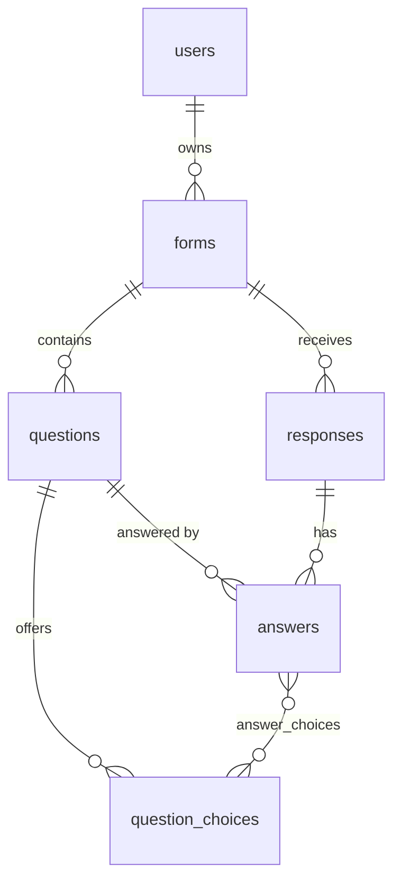

# Typeform Builder Clone

A full-stack clone of [Typeform](https://www.typeform.com): build forms in a three-pane builder with drag-and-drop and a live WYSIWYG preview, publish them to a public link, collect answers through the one-question-at-a-time animated flow, and review results with per-question summaries.

- **Live demo:** https://scaler-ai-typeform-builder-clone.vercel.app (frontend on Vercel)
- **API:** https://aryan-typeform-clone-api.onrender.com/docs (FastAPI on Render)
- **Stack:** Next.js 16 (TypeScript, App Router, Tailwind CSS 4) · FastAPI · SQLAlchemy 2 · SQLite

> The API runs on Render's free tier, which sleeps when idle. The first request can take up to ~50 s while it wakes up (the UI shows a "waking up the server" hint).

---

## Features

### Form builder (`/form/:id/create`)
- Three-pane layout like Typeform: question list · live canvas · settings panel
- **8 question types:** short text, long text, multiple choice (single or multi-select), dropdown, email, number (min/max), yes/no, rating (3–10 steps, stars or numbers)
- Add (searchable "Add content" modal), edit inline, duplicate, delete, **drag-and-drop reorder** (mouse and keyboard via `@dnd-kit`)
- **Inline editing on the canvas:** question title, description, choice labels (Enter adds a choice, Backspace on empty removes it), welcome & thank-you screens
- Per-question settings: required toggle, type switch (keeps compatible data), type-specific options
- **Live preview:** the canvas is rendered with the form's theme; the Preview button runs the real respondent flow full-screen (desktop/mobile)
- **Design panel:** 8 theme presets, custom colors (questions, answers, buttons, background) and fonts
- **Autosave** (debounced, serialized PUTs) with a Saved/Saving indicator; warns before closing with unsaved changes
- **Logic jumps (Workflow tab):** for single-select multiple choice, dropdown and yes/no questions, route each answer to a later question or straight to the end; skipped questions aren't required or stored (enforced on the server too)
- Publish / unpublish with a "your form is live" share modal; Connect (integrations) and form settings are "Coming soon" placeholders

### Form management (`/workspace`)
- All forms with status (Draft/Published), question count, response count, last updated
- Create (modal), rename, duplicate, delete (with confirmation), copy public link
- List/grid views, sort, search

### Respondent flow (`/to/:slug`) — no login
- Full-screen, one question at a time, slide/fade transitions between questions
- Welcome screen with "Takes N minutes", progress bar, up/down navigation buttons
- **Keyboard:** Enter = OK/next, ↑/↓ = previous/next, A–Z to pick choices, Y/N for yes/no, 1–9/0 for ratings, Shift+Enter for line breaks; typing anywhere focuses the answer field
- Auto-advance after single-select answers (with the Typeform selection blink)
- **Client + server validation** (required, email format, number + min/max, rating range, valid choice ids, max length), Typeform-style error messages
- Submit stores the response and shows the custom thank-you screen

### Results (`/form/:id/results`)
- **Summary:** views, starts, submissions, completion rate, average completion time; per-question cards with bar charts (choices, yes/no, rating distribution), averages (rating/number), latest text answers
- **Responses:** table of all submissions (one column per question), search, click a row to open the full response in a side drawer, delete responses
- **Export CSV**

### Bonus items implemented
Logic jumps / basic branching · custom themes (colors + fonts) · CSV export · partial-response tracking (views → starts → submissions funnel and completion rate)

---

## Architecture

```
┌──────────────────────────────┐        JSON over HTTPS        ┌───────────────────────────────┐
│ Next.js (frontend/)          │ ───────────────────────────▶ │ FastAPI (backend/)             │
│                              │                               │                               │
│ app/workspace     forms list │   /api/forms…   (creator)     │ routers/  HTTP layer          │
│ app/form/[id]/*   builder,   │   /api/public…  (respondent)  │ services/ business logic      │
│                   share,     │                               │   forms.py      sync/duplicate│
│                   results    │                               │   validation.py answer rules  │
│ app/to/[slug]     public flow│                               │   responses.py  stats, CSV    │
│                              │                               │ models.py SQLAlchemy ORM      │
│ components/renderer  (shared │                               │ schemas.py Pydantic I/O       │
│   by preview + public flow)  │                               │ seed.py demo data             │
│ components/builder (editor)  │                               │            │                  │
│ lib/ api client, types,      │                               │            ▼                  │
│      validation, themes      │                               │        SQLite                 │
└──────────────────────────────┘                               └───────────────────────────────┘
```

**Key decisions**

- **Document-style builder saves.** The builder edits the whole form in client state (`FormEditorProvider`) and autosaves with `PUT /api/forms/:id` containing the full definition — the same model Typeform's own Create API uses. The server *syncs* that document: questions/choices are matched by id, updated in place (so existing answers survive edits/reorders), inserted if new, deleted if missing.
- **Client-generated UUIDs.** New questions/choices get a UUID in the browser and the server accepts it (after validating it isn't used elsewhere). This means no temporary-id reconciliation after each autosave, so the user can keep typing while saves are in flight.
- **One renderer, two uses.** `components/renderer/FormRenderer` powers both the public `/to/:slug` page and the builder's Preview modal (`mode="preview"` skips the API), so what creators preview is exactly what respondents get.
- **Branching computed identically on both sides.** lib/logic.ts and services/logic.py compute the respondent's path from their answers (forward-only jumps, so no loops). The renderer keeps a history stack so "previous" retraces the actual path; the server validates and stores only questions on that path.
- **Validation in two places.** `lib/validation.ts` (instant feedback) mirrors `services/validation.py` (authoritative). The server returns per-question errors (`422 {detail: {errors: {questionId: message}}}`) and the flow jumps back to the first invalid question.
- **Themes as CSS variables.** A form's theme becomes `--tf-*` custom properties; all respondent styles (`.tf-input`, `.tf-choice`, `.tf-button`…) derive tints with `color-mix()`, so any color combination looks right.
- **Auth is simplified** to a single default creator (`deps.get_current_user`) — swapping in real auth only touches that dependency.

---

## Database schema



| Table | Columns | Notes |
|---|---|---|
| `users` | `id` PK, `name`, `email` UNIQUE, `created_at` | Default creator is seeded |
| `forms` | `id` UUID PK, `owner_id` FK→users, `title`, `slug` UNIQUE, `status` CHECK(draft/published), `theme` JSON, `settings` JSON, `view_count`, `start_count`, `published_at`, `created_at`, `updated_at` | `slug` is the public link id (`/to/<slug>`); `theme`/`settings` (welcome & thank-you screens) are always read whole, so JSON is appropriate |
| `questions` | `id` UUID PK, `form_id` FK→forms CASCADE, `position`, `type` CHECK(8 types), `title`, `description`, `required`, `properties` JSON | `properties` holds type-specific options (`allow_multiple`, `steps`, `shape`, `min`, `max`, `max_length`); index on `(form_id, position)` |
| `question_choices` | `id` UUID PK, `question_id` FK→questions CASCADE, `position`, `label` | Normalized so choice answers reference real rows and summary counts are a simple join |
| `responses` | `id` UUID PK, `form_id` FK→forms CASCADE, `started_at`, `submitted_at`, `user_agent` | `started_at` → average completion time; index on `(form_id, submitted_at)` |
| `answers` | `id` PK, `response_id` FK→responses CASCADE, `question_id` FK→questions CASCADE, `value_text`, `value_number`, `value_boolean` | UNIQUE `(response_id, question_id)`; one typed column per answer kind |
| `answer_choices` | `answer_id` FK→answers, `choice_id` FK→question_choices (composite PK) | Many-to-many for single/multi-select answers; `answers.value_text` keeps a label snapshot so old answers stay readable if a choice is renamed or removed |

SQLite foreign keys are enabled per connection (`PRAGMA foreign_keys=ON`) so cascades are enforced by the database. Timestamps are stored in UTC.

---

## API overview

All endpoints are JSON. Interactive docs: `http://localhost:8000/docs`.

**Creator (assumes the default logged-in creator)**

| Method | Path | Description |
|---|---|---|
| GET | `/api/me` | Current creator |
| GET | `/api/forms` | List forms with `status`, `response_count`, `question_count` |
| POST | `/api/forms` | Create a form `{title}` |
| GET | `/api/forms/{id}` | Full form (questions + choices, theme, settings) |
| PUT | `/api/forms/{id}` | Replace the form definition (builder autosave) |
| PATCH | `/api/forms/{id}` | Rename `{title}` |
| DELETE | `/api/forms/{id}` | Delete form (cascades to questions/responses) |
| POST | `/api/forms/{id}/duplicate` | Deep-copy as a new draft |
| POST | `/api/forms/{id}/publish` · `/unpublish` | Toggle public availability (publish requires ≥1 titled question) |
| GET | `/api/forms/{id}/responses?limit&offset` | Paginated responses with answers |
| GET / DELETE | `/api/forms/{id}/responses/{responseId}` | One response / delete it |
| GET | `/api/forms/{id}/summary` | Funnel stats + per-question summaries |
| GET | `/api/forms/{id}/responses.csv` | CSV export |

**Public (no auth)**

| Method | Path | Description |
|---|---|---|
| GET | `/api/public/forms/{slug}` | Published form definition (404 if draft/unknown) |
| POST | `/api/public/forms/{slug}/events` | `{type: "view" \| "start"}` funnel tracking |
| POST | `/api/public/forms/{slug}/responses` | Submit `{answers: {questionId: value}, started_at}`; validated server-side |

Answer value formats: text/email → string, number/rating → number, yes/no → boolean, multiple choice → array of choice ids, dropdown → choice id.

---

## Running locally

**Prerequisites:** Python 3.11+ and Node.js 20+.

```bash
# 1. Backend (http://localhost:8000)
cd backend
python -m venv .venv
.venv\Scripts\activate          # Windows  (macOS/Linux: source .venv/bin/activate)
pip install -r requirements-dev.txt
uvicorn app.main:app --reload --port 8000
```

The SQLite database (`backend/typeform.db`) is created and **seeded automatically** on first start: a default creator, two published forms with mixed question types and 23 responses, and one draft. Reset it any time with `python -m app.seed --reset`.

```bash
# 2. Frontend (http://localhost:3000)
cd frontend
cp .env.example .env.local      # NEXT_PUBLIC_API_URL=http://localhost:8000
npm install
npm run dev
```

```bash
# Tests (backend)
cd backend && pytest
```

---

## Deployment

**1. Backend → Render** (uses `render.yaml`)

[](https://render.com/deploy?repo=https://github.com/Aryan-Kochhar/Scaler-AI-Typeform-Builder-Clone)

Creates a free web service `aryan-typeform-clone-api` (root `backend/`, start: `uvicorn app.main:app --host 0.0.0.0 --port $PORT`, health check `/api/health`). Note the service URL, e.g. `https://aryan-typeform-clone-api.onrender.com`.

**2. Frontend → Vercel**

[](https://vercel.com/new/import?s=https%3A%2F%2Fgithub.com%2FAryan-Kochhar%2FScaler-AI-Typeform-Builder-Clone&root-directory=frontend&env=NEXT_PUBLIC_API_URL)

Set **Root Directory** to `frontend` and `NEXT_PUBLIC_API_URL` to the Render URL from step 1. (If unset, production builds default to `https://aryan-typeform-clone-api.onrender.com`.)

---

## Assumptions, mocks & notes

- **Authentication is simplified**: every builder request acts as one seeded default creator. Filling a published form never requires login.
- **SQLite on Render's free tier is ephemeral**: the database is re-created and re-seeded whenever the service restarts or redeploys (e.g. after idling). Forms you create in the hosted demo may disappear later; locally, data persists in `backend/typeform.db`. A persistent disk or Postgres (`DATABASE_URL`) would fix this in production.
- **Views/starts** are lightweight counters (one `view` per page load, one `start` on the first interaction) used for completion rate; they are not de-duplicated per visitor.
- Deleting a question also deletes its answers (cascade). Renaming/removing a choice keeps old answers readable via the stored label snapshot.
- Logic jumps cover single-select choice, dropdown and yes/no questions with forward jumps only; conditions on text/number answers, scoring and variables are placeholders.
- Placeholders ("Coming soon"): scoring/variables, integrations (Connect tab), embed/email/QR sharing, team workspaces & sharing, extra question types (file upload, payment, date, phone, etc.), form settings (notifications, scheduling, language), background images, billing.
- The "typeform" wordmark is a plain-text label for this educational clone; no Typeform assets or code are used.

## Project structure

```
backend/
  app/
    main.py            FastAPI app, CORS, startup seeding
    database.py        engine/session, SQLite FK pragma
    models.py          ORM models (schema above)
    schemas.py         Pydantic request/response models
    deps.py            default-creator dependency
    routers/           forms.py · responses.py · public.py
    services/          forms.py · validation.py · logic.py · responses.py
    seed.py            demo data
  tests/test_api.py
frontend/
  src/app/             workspace, form/[formId]/{create,workflow,connect,share,results}, to/[slug]
  src/components/
    builder/           FormEditorProvider (state + autosave), header, sidebar (dnd), canvas, panels, preview
    renderer/          FormRenderer + answer inputs (shared by preview & public flow)
    workspace/ ui/     forms list pieces, modal, menu, toggle
  src/lib/             api client, types, validation, logic jumps, themes, question type registry
render.yaml            Render blueprint for the API
```
